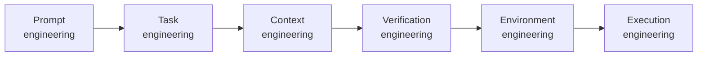

# Professional Agentic Product Engineering Guide

**Main maintainer:** Alexey Krivitsky (alexey@krivitsky.com)  
**Upstream repo:** https://github.com/krivitsky/professional-agentic-product-engineering  
**Submit PR with improvements** — ⭐ star it, contribute, help yourself and the next person learn better.

## Goal of this Guide

A mid-2026 field guide — updated continuously — to getting good at operating a coding agent (using the example of a popular agentic coding harness, Claude Code by Anthropic) for creating new software and working on real codebases.

It spans the full range: from "fix bug xyz" all the way to autonomous engineering loops running in production.

Calibrated for the current frontier class — Opus 4.8+, GPT-5.5-class+, Gemini 3.x+.

## The one idea

Professional agentic engineering is **not prompt engineering. It's engineering the system around the model.** As the work gets harder, *where you apply effort* climbs a ladder — the prompt shrinks while the system around it grows:

The eight tiers are the detailed rungs of that one climb. Learn the ladder and the 60 tips fall into place.

## Who this is for

- **Engineers and technical founders** — *operate* an agent in a real repo, not vibe-code a demo.
- **Product managers** closing the tech gap — ship real changes, not just specs.
- **Senior leaders** who want real hands-on experience, not slideware.
- **Non-IT professionals** entering product development in the age of AI.

## Your level — where to start

If you've used a coding agent a few times and want to get professional, start at the top and stop climbing wherever you are today.

Already more fluent? Jump straight to the tier that matches you — or tell your agent to skip ahead to the sections you need.

## What's inside

- **[`guide.md`](guide.md)** — the Guide itself. One ladder of **eight tiers, simple → hard**, where the work shifts from wording the prompt to engineering the system around the model:

  | Tier | You learn to… |
  |---|---|
  | **T1 Prompts** | Write prompts the agent can act on |
  | **T2 Plan & slice** | Plan and slice before you build |
  | **T3 Context** | Give the agent the right context and tools |
  | **T4 Verify loop** | Make the agent prove it's done *(the heart of it)* |
  | **T5 Git** | Checkpoint everything so you can roll back |
  | **T6 Orchestrate** | Run many agents at once |
  | **T7 Fleet** | Operate your agents as a fleet |
  | **T8 Production** | Put agents into production (the execution layer) |

  Climb only as high as your work demands — then stop.

- **[`CLAUDE.md`](CLAUDE.md)** — turns Claude Code into an interactive **tutor** for the Guide. Open this repo in Claude Code and it teaches you the Guide hands-on: one small concept at a time, you do each one, and a separate quizmaster checks that it stuck.

## How to use it

**Learn it with an agent (the fastest way through).** Open this repo in [Claude Code](https://claude.com/claude-code) and say `hi` — it tutors you through the [Guide](guide.md) hands-on. See **[CLAUDE.md](CLAUDE.md)** for how that works.

**Or just read it.** Open the [Guide](guide.md) and work down the ladder to the tier your work needs.

## Contributing

⭐ If it helps, **star the repo**.

Found a better example, a fix, or a new tip? Ask your Claude to **wrap the improvement into a pull request** — or open one yourself. Help yourself and the next person learn better. Every improvement counts.

## Credits

**Main maintainer:** Alexey Krivitsky (alexey@krivitsky.com)  
**Upstream repo:** https://github.com/krivitsky/professional-agentic-product-engineering  
**Submit PR with improvements** — ⭐ star it, contribute, help yourself and the next person learn better.
