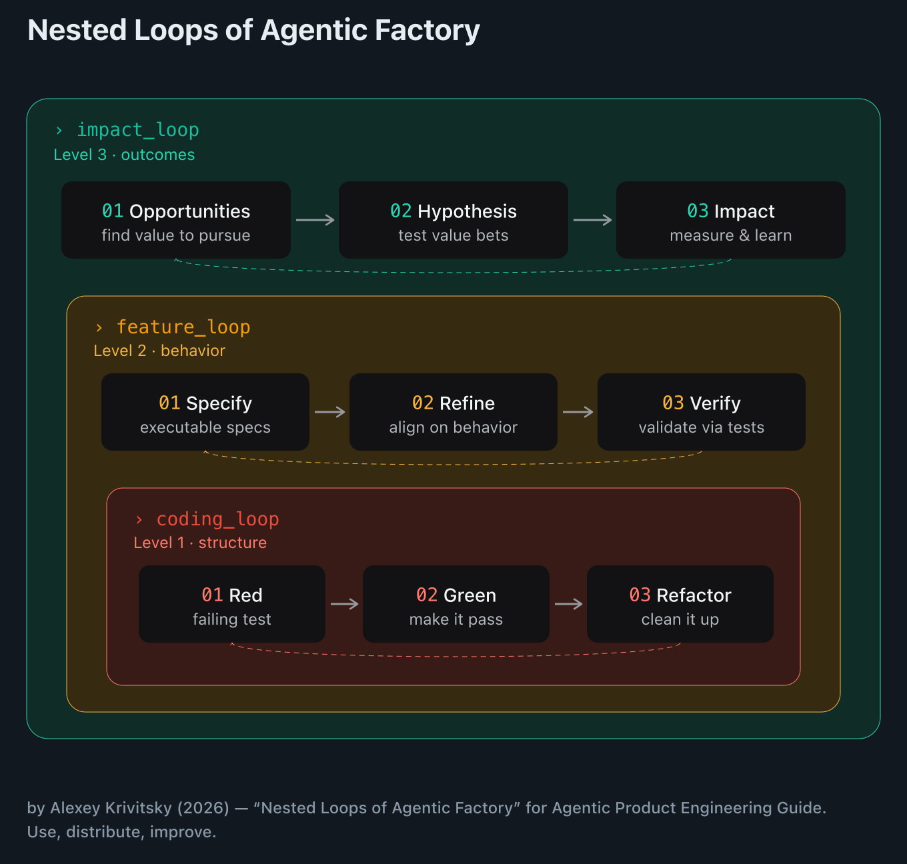

# Professional Agentic Product Engineering (PAPE) — Field Guide


> "The purpose of knowledge is action, not knowledge."
> — Aristotle

**Professional agentic engineering is not prompt engineering — it's engineering the system around the model.** As the work gets harder, the effort moves up the ladder: the prompt shrinks while the system around it grows.

This repo — a **tutor mode** and an **Agentic Coach** — is based on the [Professional Agentic Product Engineering Guide](guide.md). These materials and harness nudge you to the right tip of your growing product engineering skills.

> [!TIP]
> **Formats of the Guide** — read it in whichever form fits how you work; all three stay in sync with this repo:
> - **📄 Markdown** — [`guide.md`](guide.md), the canonical source. Best for reading in your editor, feeding to an agent, or sending a PR.
> - **📖 Online** — [agentic-engineering.guide](https://agentic-engineering.guide/) — a browsable web version: one page per tier, dark/light mode, easy to share. Built from `guide.md` by the static-site generator in [`web/`](web/) and rebuilt on every change, so it never drifts.
> - **🕸️ Obsidian vault** — the [`wiki/`](wiki/) folder is a wikified version: the guide split into `[[wikilink]]`-cross-referenced pages (one per tier, concept, and entity). Open `wiki/` as an [Obsidian](https://obsidian.md) vault to navigate by graph and *study* the material, not just read it top-to-bottom.

The Guide is kept up-to-date to track how the best teams operate coding agents — the full range, from "fix bug xyz" to autonomous engineering loops in production.

Calibrated for the current frontier class — Opus 4.8+, GPT-5.5-class+, Gemini 3.x+.

## Who this is for

- **Engineers and technical founders** — *operate* an agent in a real repo, not vibe-code a demo.
- **Product managers** closing the tech gap — ship real changes, not just specs.
- **Senior leaders** who want real hands-on experience, not slideware.
- **Non-IT professionals** entering product development in the age of AI.

## Big Idea 💡: From Prompts to Systems

Professional agentic engineering is **not prompt engineering — it's engineering the system around the model.** That system isn't a line; it's **three nested loops** ([the value-factory model](https://www.krivitsky.com/post/value-factory-nested-loops)) — a tight **coding loop** (red → green → refactor) inside a **feature loop** (specify → refine → verify), inside an **impact loop** (opportunities → hypothesis → impact):



The eight tiers are how you make these loops close on their own — from wording a single prompt (T1) to whole loops running autonomously in production (T8). The prompt shrinks; the system grows.

## What's inside

**Three in one** — the same material in three forms: read it, get tutored through it, or get coached *while you work*.

### 1) The Guide — [`guide.md`](guide.md)

One ladder of **eight tiers, simple → hard**, where the work shifts from wording the prompt to engineering the system around the model:

| Tier | You learn to… |
|---|---|
| [**T1 Professional Prompting**](guide.md#tier-1) | Write prompts the agent can act on |
| [**T2 Shaping & Slicing**](guide.md#tier-2) | Plan and slice before you build |
| [**T3 Context Management**](guide.md#tier-3) | Give the agent the right context and tools |
| [**T4 Loop Until Done**](guide.md#tier-4) | Make the agent prove it's done *(the heart of it)* |
| [**T5 Checkpointing & Hardening**](guide.md#tier-5) | Checkpoint in git; wire tests & CI into the harness |
| [**T6 Orchestration**](guide.md#tier-6) | Run many agents at once |
| [**T7 Fleet Ops**](guide.md#tier-7) | Operate your agents as a fleet |
| [**T8 Agent Execution Layer**](guide.md#tier-8) | Put agents into production (the execution layer) |

Climb only as high as your work demands. New to this? Start at **T1**; already fluent? jump straight to the tier that matches you.

Every tip is a concrete **Instead → Prefer** pair — the anti-example, then the fix. E.g. Tip 1.2:

> ❌ "Clean up the auth code."
>
> ✅ "Extract token refresh in `session.ts` into the existing `RetryPolicy` class."

### 2) The Tutor — [`CLAUDE.md`](CLAUDE.md)

Turns Claude Code into an interactive tutor for the Guide: one small concept at a time, you do each one, and a separate quizmaster checks that it stuck.

**Use it** — clone the repo, open Claude Code in the folder, and say `hi`. It diagnoses your level and starts teaching:

```shell
git clone https://github.com/krivitsky/professional-agentic-product-engineering
cd professional-agentic-product-engineering
claude        # then type:  hi
```

*Shown with [Claude Code](https://claude.com/claude-code), the example harness used throughout — but the Guide and Tutor are harness-agnostic; this repo ships both `CLAUDE.md` and `AGENTS.md`, so any agent that reads them works.*

**It reads your real prompts first (with consent).** Instead of interrogating you, the tutor offers to glance at your past Claude Code prompts across your local projects and build a *portrait* — your stack, your prompting habits, the tier those imply.

Then it tailors each lesson's examples to *your* stack and repos — and aims its advice at the prompting habits it actually saw in your history — instead of a generic textbook example.

Read-only and local — nothing leaves your machine.

> "First impressions? Good :) It reads my history and estimates my current level, but is also transparent and asks me for my self assessment. Tell tell sign of quality — right there."
> — [Magnus Vestin](https://www.linkedin.com/feed/update/urn:li:activity:7477965874549739520?commentUrn=urn%3Ali%3Acomment%3A%28activity%3A7477965874549739520%2C7477975689984442368%29&dashCommentUrn=urn%3Ali%3Afsd_comment%3A%287477975689984442368%2Curn%3Ali%3Aactivity%3A7477965874549739520%29)

### 3) The Coach — [`agentic-coach`](plugins/agentic-coach)

An ambient coach — install it once, then work in Claude Code as you normally would. It watches silently; most turns it says nothing. It speaks up *only* when it catches a learning opportunity, and links you straight to the fix.

You're mid-task, about to take a shortcut:

> **You → Claude:** "Delete these failing tests — I just need the build green."
>
> **🧭 Agentic Coach** — *catching a learning opportunity:*
>
> 💡 **Red test? Find out *why* before you delete it.** Code regressed → fix the code (deleting it buries a live bug); feature gone or test stale → cleanup's fine. → **[Tier 4 — make the agent prove it's done](guide.md#tier-4)**

It catches the *thinking*, not the syntax — one catch, one nudge, one click to the Guide, then quiet again.

**Install it** — add the marketplace, install, reload:

```shell
/plugin marketplace add krivitsky/professional-agentic-product-engineering
/plugin install agentic-coach@pae
/reload-plugins
```

Then just work — it nudges when it catches something. Say `coach me` to ask it directly, or `stop coaching` to silence it. *(Needs `jq` on your PATH.)*

## What people are saying

> "Nice! Thank you for the compact guide where all the basics are in one place."
> — [Michal Svoboda](https://www.linkedin.com/feed/update/urn:li:activity:7477694511788421120?commentUrn=urn%3Ali%3Acomment%3A%28activity%3A7477694511788421120%2C7478060488128356352%29&dashCommentUrn=urn%3Ali%3Afsd_comment%3A%287478060488128356352%2Curn%3Ali%3Aactivity%3A7477694511788421120%29), Security & Engineering Mentor

## Contributing

⭐ [Star the repo](https://github.com/krivitsky/professional-agentic-product-engineering) if it helps.

Found a better example, a fix, or a new tip? **Submit an issue or PR** — or just ask your harness (Claude, etc.) to open one for you. Help yourself and the next person learn better.


## Credits

**Maintainer:** [Alexey Krivitsky](https://www.linkedin.com/in/alexeykrivitsky/) (alexey@krivitsky.com)  
**Upstream:** https://github.com/krivitsky/professional-agentic-product-engineering
