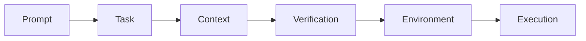

# Professional Agentic Product Engineering

The field guide — **plus an Agentic Coach** that catches your thinking mistakes and nudges you to the right tip while you code.

**Main maintainer:** Alexey Krivitsky (alexey@krivitsky.com)  
**Upstream repo:** https://github.com/krivitsky/professional-agentic-product-engineering  
**Submit PR with improvements** — ⭐ star it, contribute, help yourself and the next person learn better.

A mid-2026 field guide — updated continuously — to getting good at operating a coding agent (using the example of a popular agentic coding harness, Claude Code by Anthropic) for creating new software and working on real codebases. It spans the full range: from "fix bug xyz" to autonomous engineering loops in production. Calibrated for the current frontier class — Opus 4.8+, GPT-5.5-class+, Gemini 3.x+.

## See it catch you

The Guide also ships as an **ambient coach** — install it once, then work in Claude Code exactly as you normally would. It watches silently; most turns it says nothing. It speaks up *only* when it catches a learning opportunity, and links you straight to the fix.

You're mid-task, about to take a shortcut:

> **You → Claude:** "Delete these failing tests — I just need the build green."
>
> **🧭 Agentic Coach** — *catching a learning opportunity:*
>
> 💡 **[Tip 32](guide.md#tip-32) — Red tests are signal, not noise.** Before deleting a red test, know *why* it's red: code regressed → fix the code (deleting it buries a live bug); feature gone or test stale → cleanup's fine.

You're talking to Claude; the coach just listens in — one catch, one tip, one click to the Guide, then quiet again. It catches the *thinking*, not the syntax. **[Install it ↓](#how-to-use-it)**

## Who this is for

- **Engineers and technical founders** — *operate* an agent in a real repo, not vibe-code a demo.
- **Product managers** closing the tech gap — ship real changes, not just specs.
- **Senior leaders** who want real hands-on experience, not slideware.
- **Non-IT professionals** entering product development in the age of AI.

## What's inside

Three ways into the same material — read it, get tutored through it, or get coached *while you work*. New to this? Start at the top of the ladder and **stop climbing wherever your work needs**. Already fluent? Jump straight to the tier that matches you, or tell your agent to skip ahead.

- **[`guide.md`](guide.md)** — the **Professional Agentic Product Engineering Guide** itself. One ladder of **eight tiers, simple → hard**, where the work shifts from wording the prompt to engineering the system around the model:

  | Tier | You learn to… |
  |---|---|
  | **T1 Prompts** | Write prompts the agent can act on |
  | **T2 Plan & slice** | Plan and slice before you build |
  | **T3 Context** | Give the agent the right context and tools |
  | **T4 Verify loop** | Make the agent prove it's done *(the heart of it)* |
  | **T5 Git** | Checkpoint everything so you can roll back |
  | **T6 Orchestrate** | Run many agents at once |
  | **T7 Fleet** | Operate your agents as a fleet |
  | **T8 Production** | Put agents into production (the execution layer) |

  Climb only as high as your work demands — then stop.

- **[`CLAUDE.md`](CLAUDE.md)** — turns Claude Code into an interactive **tutor** for the Guide: one small concept at a time, you do each one, and a separate quizmaster checks that it stuck.
- **[`agentic-coach`](plugins/agentic-coach)** — the **ambient coach** plugin from above: in-the-flow nudges to the right tip, no lesson required.

## Engineer the system, not the prompt

Those eight tiers are the rungs of **one** climb. Professional agentic engineering is **not prompt engineering — it's engineering the system around the model.** As the work gets harder, *where you apply effort* moves up the ladder; the prompt shrinks while the system around it grows:



Learn the ladder and the 60 tips fall into place.

## How to use it

**Learn it with an agent (the fastest way through).** Open this repo in [Claude Code](https://claude.com/claude-code) and say `hi` — it tutors you through the [Guide](guide.md) hands-on. See **[CLAUDE.md](CLAUDE.md)** for how that works.

**Or just read it.** Open the [Guide](guide.md) and work down the ladder to the tier your work needs.

**Or install the ambient coach** (the demo above) into any repo:

```shell
/plugin marketplace add krivitsky/professional-agentic-product-engineering
/plugin install agentic-coach@pae
```

Then just work — it nudges when it catches something. Say *"coach me"* to ask it directly, or *"stop coaching"* to silence it.

## Contributing

⭐ If it helps, **star the repo**.

Found a better example, a fix, or a new tip? Ask your Claude to **wrap the improvement into a pull request** — or open one yourself. Help yourself and the next person learn better. Every improvement counts.

## Credits

**Main maintainer:** Alexey Krivitsky (alexey@krivitsky.com)  
**Upstream repo:** https://github.com/krivitsky/professional-agentic-product-engineering  
**Submit PR with improvements** — ⭐ star it, contribute, help yourself and the next person learn better.
