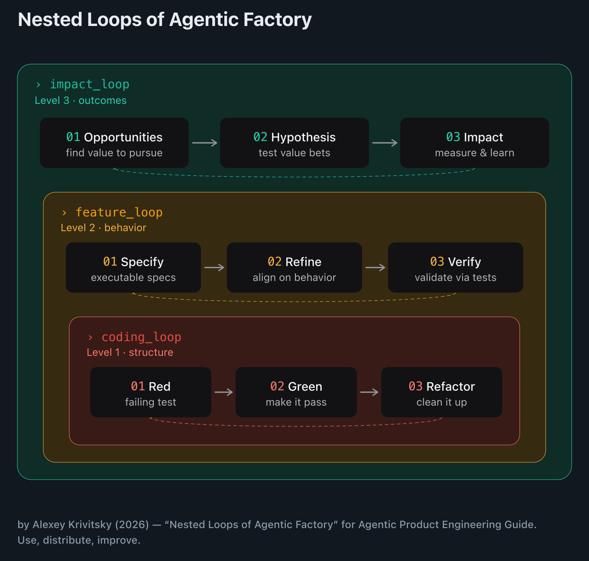
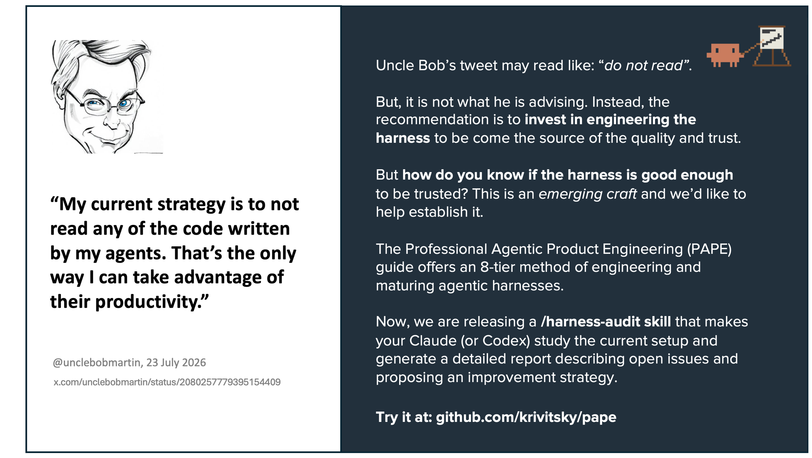

# Professional Agentic Product Engineering (PAPE) — Field Guide

> [!NOTE]
> 🧭 **Agentic Shift** — Join a **professional learning community** for builders and leaders — [Apply now →](https://agentic-shift.com/community)


> "The purpose of knowledge is action, not knowledge."
> — Aristotle

**Professional agentic engineering is not prompt engineering — it's engineering the system around the model.** As the work gets harder, the effort moves up the ladder: the prompt shrinks while the system around it grows.

This repo is four ways into the [Professional Agentic Product Engineering Guide](guide.md): **read it**, get **tutored** through it, install the **coach** for ambient nudges as you work, or **[audit a repo's harness](https://agentic-engineering.guide/audit-your-harness)** against it. These materials and harness nudge you to the right tip of your growing product engineering skills.

> [!TIP]
> **Formats of the Guide** — read it in whichever form fits how you work; all four stay in sync with this repo:
> - **📄 Markdown** — [`guide.md`](guide.md), the canonical source. Best for reading in your editor, feeding to an agent, or sending a PR.
> - **📖 Online** — [agentic-engineering.guide](https://agentic-engineering.guide/) — a browsable web version: one page per tier, dark/light mode, easy to share. Built from `guide.md` by the static-site generator in [`web/`](web/) and rebuilt on every change, so it never drifts.
> - **🕸️ Obsidian vault** — the [`wiki/`](wiki/) folder is a wikified version: the guide split into `[[wikilink]]`-cross-referenced pages (one per tier, concept, and entity). Open `wiki/` as an [Obsidian](https://obsidian.md) vault to navigate by graph and *study* the material, not just read it top-to-bottom.
> - **🔌 In your repo** — install the [plugin](plugins/pape) (`/plugin install pape@pape`) and the whole guide ships with it, byte-identical and enforced by CI. `/pape:agentic-coach` quotes tips from it as you work, and `/pape:harness-audit` rates the repo you're in against the eight tiers — see [Audit your harness](https://agentic-engineering.guide/audit-your-harness). The guide is *there* while you work, instead of somewhere you go.

The Guide is kept up-to-date to track how the best teams operate coding agents — the full range, from "fix bug xyz" to autonomous engineering loops in production.

Calibrated for the current frontier class — Opus 4.8+, GPT-5.5-class+, Gemini 3.x+.

## Who this is for

- **Engineers and technical founders** — *operate* an agent in a real repo, not vibe-code a demo.
- **Product managers** closing the tech gap — ship real changes, not just specs.
- **Senior leaders** who want real hands-on experience, not slideware.
- **Non-IT professionals** entering product development in the age of AI.

## Big Idea 💡: From Prompts to Systems

Professional agentic engineering is **not prompt engineering — it's engineering the system around the model.** That system isn't a line; it's **three nested loops** ([the value-factory model](https://www.krivitsky.com/post/value-factory-nested-loops)) — a tight **coding loop** (red → green → refactor) inside a **feature loop** (specify → refine → verify), inside an **impact loop** (opportunities → hypothesis → impact):



The eight tiers are how you make these loops close on their own — from wording a single prompt (T1) to whole loops running autonomously in production (T8). The prompt shrinks; the system grows.

## What's inside

**Four in one** — the same material in four forms: read it, get tutored through it, get coached *while you work*, or have a real repo **audited** against it.

Not sure where you stand? **Start with the audit (4)** — it rates all eight tiers on a repo you actually work in and names the one rung to fix. The tutor and the coach both pick up from there.

### 1) The Guide — [`guide.md`](guide.md)

One ladder of **eight tiers, simple → hard**, where the work shifts from wording the prompt to engineering the system around the model:

| Tier | You learn to… |
|---|---|
| [**T1 Professional Prompting**](guide.md#tier-1) | Write prompts the agent can act on |
| [**T2 Shaping & Slicing**](guide.md#tier-2) | Plan and slice before you build |
| [**T3 Context Management**](guide.md#tier-3) | Give the agent the right context and tools |
| [**T4 Loop Until Done**](guide.md#tier-4) | Make the agent prove it's done *(the heart of it)* |
| [**T5 Checkpointing & Hardening**](guide.md#tier-5) | Checkpoint in git; wire tests & CI into the harness |
| [**T6 Orchestration**](guide.md#tier-6) | Run many agents at once |
| [**T7 Fleet Ops**](guide.md#tier-7) | Operate your agents as a fleet |
| [**T8 Agent Execution Layer**](guide.md#tier-8) | Put agents into production (the execution layer) |

Climb only as high as your work demands. New to this? Start at **T1**; already fluent? jump straight to the tier that matches you.

Every tip is a concrete **Instead → Prefer** pair — the anti-example, then the fix. E.g. Tip 1.2:

> ❌ "Clean up the auth code."
>
> ✅ "Extract token refresh in `session.ts` into the existing `RetryPolicy` class."

### 2) The Tutor — [`CLAUDE.md`](CLAUDE.md)

Turns Claude Code into an interactive tutor for the Guide: one small concept at a time, you do each one, and a separate quizmaster checks that it stuck.

**Use it** — clone the repo, open Claude Code in the folder, and say `hi`. It diagnoses your level and starts teaching:

```shell
git clone https://github.com/krivitsky/professional-agentic-product-engineering
cd professional-agentic-product-engineering
claude        # then type:  hi
```

*Shown with [Claude Code](https://claude.com/claude-code), the example harness used throughout — but the Guide and Tutor are harness-agnostic; this repo ships both `CLAUDE.md` and `AGENTS.md`, so any agent that reads them works.*

**It reads your real prompts first (with consent).** Instead of interrogating you, the tutor offers to glance at your past Claude Code prompts across your local projects and build a *portrait* — your stack, your prompting habits, the tier those imply.

Then it tailors each lesson's examples to *your* stack and repos — and aims its advice at the prompting habits it actually saw in your history — instead of a generic textbook example.

Read-only and local — nothing leaves your machine.

**Your prompts show T1–T2; your repo shows T3–T8.** So the tutor also offers to audit a repo you actually work in, and uses the two together to place you — no self-assessment quiz. Already run the audit? It reads that report and starts at the rung it named. See **(4)** below.

> "First impressions? Good :) It reads my history and estimates my current level, but is also transparent and asks me for my self assessment. Tell tell sign of quality — right there."
> — [Magnus Vestin](https://www.linkedin.com/feed/update/urn:li:activity:7477965874549739520?commentUrn=urn%3Ali%3Acomment%3A%28activity%3A7477965874549739520%2C7477975689984442368%29&dashCommentUrn=urn%3Ali%3Afsd_comment%3A%287477975689984442368%2Curn%3Ali%3Aactivity%3A7477965874549739520%29)

### 3) The Coach — [`/pape:agentic-coach`](plugins/pape)

An ambient coach — install it once, then work in Claude Code as you normally would. It watches silently; most turns it says nothing. It speaks up *only* when it catches a learning opportunity, and links you straight to the fix.

You're mid-task, about to take a shortcut:

> **You → Claude:** "Delete these failing tests — I just need the build green."
>
> **🧭 Agentic Coach** — *catching a learning opportunity:*
>
> 💡 **Red test? Find out *why* before you delete it.** Code regressed → fix the code (deleting it buries a live bug); feature gone or test stale → cleanup's fine. → **[Tier 4 — make the agent prove it's done](guide.md#tier-4)**

It catches the *thinking*, not the syntax — one catch, one nudge, one click to the Guide, then quiet again.

**Install it** — add the marketplace, install, reload:

```shell
/plugin marketplace add krivitsky/professional-agentic-product-engineering
/plugin install pape@pape
/reload-plugins
```

Then just work — it nudges when it catches something. Say `coach me` to ask it directly, or `stop coaching` to silence it. *(Needs `jq` on your PATH.)*

**`pape`** is this guide's acronym — Professional Agentic Product Engineering. It names the marketplace *and* the plugin, which is why the install line reads `pape@pape` and why both skills are namespaced under it:

| Command | What it is |
|---|---|
| **`/pape:agentic-coach`** | the ambient coach — this section |
| **`/pape:harness-audit`** | the audit — the next section |

One install, both skills. The coach and the audit are the two halves of the same idea: one catches the moment, the other reads the whole repo.

### 4) The Audit — [`/pape:harness-audit`](plugins/pape/skills/harness-audit)

<a href="https://x.com/unclebobmartin/status/2080257779395154409"></a>

We all saw this powerful yet controversial tweet from Uncle Bob (aka [Robert C. Martin](https://x.com/unclebobmartin/status/2080257779395154409)), the author of *Clean Code*. Let me pause here and explain the depth of this and an interesting development that follows.

When Uncle Bob says "he no longer reads the code his agents write", that is not a recommendation to stop reading code and start being careless. It is a call to **invest in the agent's harness** so you can trust its outputs.

Which leaves the question: how do you know whether your own harness is any good? Where is it strong, where does it leak, and what should you build next?

In response to growing awareness of the need for a guide for Professional Agentic Product Engineering (PAPE), we developed a harness audit skill.

Run **`/pape:harness-audit`** to read the repo's existing agentic setup and generate a detailed 8-tier report based on the PAPE guide. The detailed report (md and html) will explain the strengths and weaknesses of your setup. It will then detail and prioritize the outstanding issues and propose a draft backlog to start fixing them.

Install it:

```
/plugin marketplace add krivitsky/professional-agentic-product-engineering
/plugin install pape@pape
/reload-plugins
```

Then, in any repo you work in:

```
/pape:harness-audit
```

It is read-only apart from the two files it writes to `harness-audits/`.

**To learn more — how it rates the eight tiers and what's in the report: [Audit your harness](https://agentic-engineering.guide/audit-your-harness).**

## What people are saying

> "Nice! Thank you for the compact guide where all the basics are in one place."
> — [Michal Svoboda](https://www.linkedin.com/feed/update/urn:li:activity:7477694511788421120?commentUrn=urn%3Ali%3Acomment%3A%28activity%3A7477694511788421120%2C7478060488128356352%29&dashCommentUrn=urn%3Ali%3Afsd_comment%3A%287478060488128356352%2Curn%3Ali%3Aactivity%3A7477694511788421120%29), Security & Engineering Mentor

## Contributing

⭐ [Star the repo](https://github.com/krivitsky/professional-agentic-product-engineering) if it helps.

Found a better example, a fix, or a new tip? **Submit an issue or PR** — or just ask your harness (Claude, etc.) to open one for you. Help yourself and the next person learn better.

By submitting a contribution you agree it's licensed on the same terms as the part of the repo it touches — MIT for code, CC BY 4.0 for written material. No CLA to sign.


## License

Two licenses, because this repo is half tool and half writing:

| What | License |
|---|---|
| **The writing** — `guide.md`, the skill instructions, `CLAUDE.md`, `README.md`, the `wiki/` vault, and the built site | [CC BY 4.0](LICENSE-CONTENT) |
| **The code** — hook scripts, stylesheets, the site generator in `web/`, `scripts/`, CI, and the plugin manifests | [MIT](LICENSE) |

Share it, adapt it, use it commercially, teach from it. The only condition on the writing is credit:

> "Professional Agentic Product Engineering Guide" by [Alexey Krivitsky](https://www.linkedin.com/in/alexeykrivitsky/), licensed under CC BY 4.0 — https://github.com/krivitsky/professional-agentic-product-engineering

**Not mine to license**, and excluded from both: the Uncle Bob tweet screenshot (`assets/uncle-bob-tweet.jpg`, also quoted in `assets/harness-audit-banner.png`), the vibe-coding illustration adapted from [Denis Turkov](https://www.linkedin.com/posts/turkovdenis_most-engineers-starting-with-coding-agents-activity-7450420428650676224-Ldwj), and the reader quotations. Those are quoted with attribution and belong to their authors — see [LICENSE-CONTENT](LICENSE-CONTENT).

## Credits

**Maintainer:** [Alexey Krivitsky](https://www.linkedin.com/in/alexeykrivitsky/) (alexey@krivitsky.com)  
**Upstream:** https://github.com/krivitsky/professional-agentic-product-engineering
