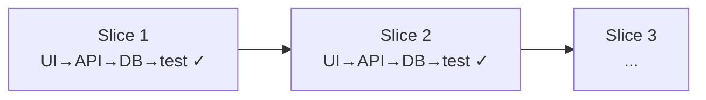
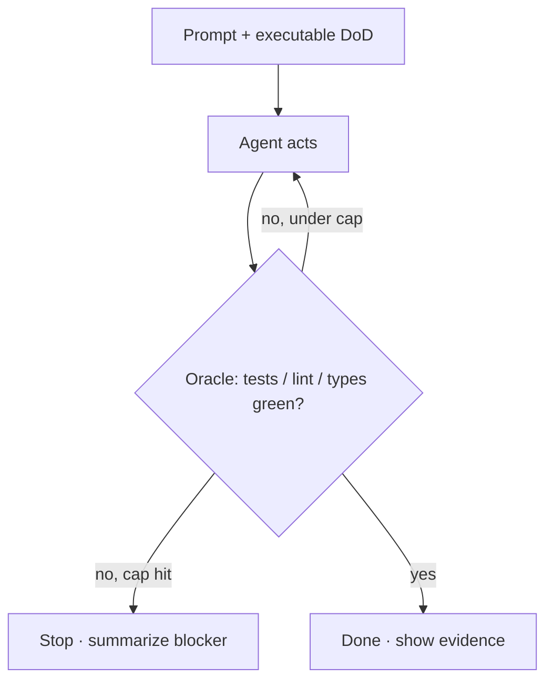
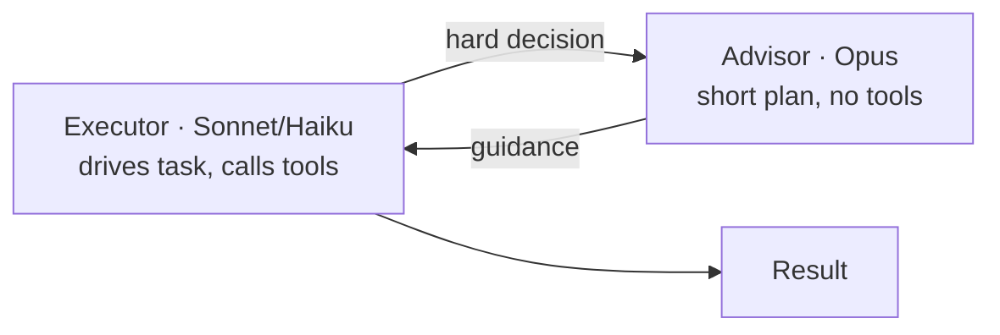
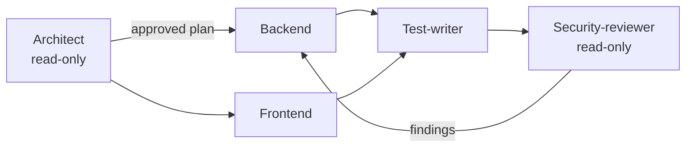
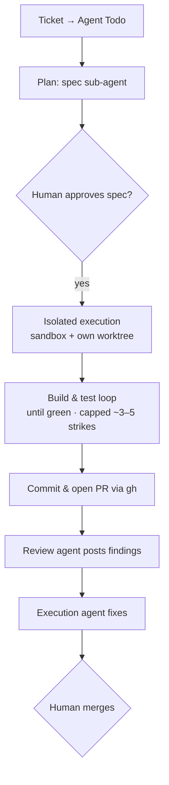

# Professional Agentic Product Engineering Guide (Mid-2026 and updated continuously)

**Main maintainer:** Alexey Krivitsky (alexey@krivitsky.com)  
**Upstream repo:** https://github.com/krivitsky/professional-agentic-product-engineering  
**Submit PR with improvements** — ⭐ star it, contribute, help yourself and the next person learn better.

### Goal of this Guide

Getting good at operating a coding agent (using the example of a popular agentic coding harness, Claude Code by Anthropic) for creating new software and working on real codebases.

It spans the full range: from "fix bug xyz" all the way to autonomous engineering loops running in production.

Calibrated for the current frontier class — **Opus 4.8+, GPT-5.5-class+, Gemini 3.x+**.

### The one idea

Professional agentic engineering is **not prompt engineering. It's engineering the system around the model.**

As the work gets harder, *where you apply effort* climbs a ladder — the prompt shrinks while the system around it grows:


The eight tiers below are the detailed rungs of that one climb (Prompt = T1, Task = T2, Context = T3, Verification = T4, Environment = T5–T7, Execution = T8). Every tip is an instance of one layer — learn the ladder and the 60 tips fall into place.

### Who this is for
- **Engineers and technical founders** — *operate* an agent in a real repo, not vibe-code a demo.
- **Product managers** closing the tech gap — ship real changes, not just specs.
- **Senior leaders** who want real hands-on experience, not slideware.
- **Non-IT professionals** entering product development in the age of AI.

### Your level — where to start

If you've used a coding agent a few times and want to get professional, start at the top and stop climbing wherever you are today.

Already more fluent? Jump straight to the tier that matches you — or tell your agent to skip ahead to the sections you need.

### TL;DR — if you do only five things
1. **Be specific and positive.** Name files, constraints, and the pattern to follow; say what to *do*, not what to avoid. (Tips 1–4)
2. **Give the agent an executable Definition of Done.** Tests/lint/typecheck as commands — that's the loop's exit condition. (Tip 31)
3. **Plan before you edit; slice the work thin.** Investigate → approve a plan → one vertical slice at a time. (Tips 15, 17, 19)
4. **Commit on every green step.** Each commit is a checkpoint the loop can revert to. (Tip 40)
5. **Engineer the environment, not the prompt.** CLAUDE.md, Skills, hooks, MCP, CI carry the intelligence. (Tip 51)

### The eight tiers at a glance

| Tier | You learn to… |
|---|---|
| **T1 Prompts** | Write prompts the agent can act on |
| **T2 Plan & slice** | Plan and slice before you build |
| **T3 Context** | Give the agent the right context and tools |
| **T4 Verify loop** | Make the agent prove it's done *(the heart of it)* |
| **T5 Git** | Checkpoint everything so you can roll back |
| **T6 Orchestrate** | Run many agents at once |
| **T7 Fleet** | Operate your agents as a fleet |
| **T8 Production** | Put agents into production (the execution layer) |

Climb only as high as your work demands — then stop.

### Contents
1. [Climb the eight tiers — to spend effort only where your work needs it (the arc)](#climb-the-eight-tiers--to-spend-effort-only-where-your-work-needs-it-the-arc)
2. [Learn this with an agent (the fastest way through)](#learn-this-with-an-agent-the-fastest-way-through)
3. [Unlearn the old playbook — so stale advice stops sabotaging you](#unlearn-the-old-playbook--so-stale-advice-stops-sabotaging-you)
4. [Pick the right tool — so you don't build production on a prototype engine (agent vs one-shot builder)](#pick-the-right-tool--so-you-dont-build-production-on-a-prototype-engine-agent-vs-one-shot-builder)
5. [Learn the primitives — so the rest of the guide clicks (your building blocks)](#learn-the-primitives--so-the-rest-of-the-guide-clicks-your-building-blocks)
6. [Tier 1 — Write prompts the agent can act on](#tier-1--write-prompts-the-agent-can-act-on-to-get-the-right-result-the-first-time)
   - 1. Hand over the outcome, not a file list
   - 2. Be specific
   - 3. Say what to do, not what to avoid
   - 4. Give the reason
   - 5. Specify the output shape
   - 6. Show examples
   - 7. Follow the house style
   - 8. Show, don't tell
   - 9. Invite uncertainty
   - 10. Paste raw errors
   - 11. Constrain scope
   - 12. Narrow the edit surface
   - 13. Dial effort
   - 14. Front-load turn 1
7. [Tier 2 — Plan and slice before you build](#tier-2--plan-and-slice-before-you-build-to-keep-every-change-small-and-safe)
   - 15. Investigate before you edit
   - 16. Plan the uncertain
   - 17. Force an approval checkpoint
   - 18. Ask for options
   - 19. Slice vertically
   - 20. Turn features into a spec
   - 21. Plan smart, build cheap
   - 22. Draft-and-critique the spec
8. [Tier 3 — Give the agent the right context and tools](#tier-3--give-the-agent-the-right-context-and-tools-so-it-stops-guessing)
   - 23. Feed high-signal context
   - 24. Keep secrets out of git and context
   - 25. `/clear` between tasks
   - 26. Steer compaction
   - 27. CLAUDE.md = gotchas + conventions
   - 28. Put occasional knowledge in Skills
   - 29. Add the right MCP servers
   - 30. Use external memory
9. [Tier 4 — Make the agent prove it's done (the loop)](#tier-4--make-the-agent-prove-its-done-so-you-can-trust-the-output-the-loop)
   - 31. Make Definition of Done executable
   - 32. Do TDD
   - 33. Use BDD
   - 34. Test the UI with Playwright MCP
   - 35. Demand evidence
   - 36. Ask for all findings
   - 37. Review with fresh eyes
   - 38. Run a pre-mortem
   - 39. Iterate UI visually
10. [Tier 5 — Checkpoint everything in git](#tier-5--checkpoint-everything-in-git-so-you-can-always-roll-back)
    - 40. Commit every working step
    - 41. Let Claude drive `gh`
    - 42. Use worktrees
    - 43. Replace "remember to run tests" with a hook
    - 44. Move repetitive engineering into CI
11. [Tier 6 — Run many agents at once](#tier-6--run-many-agents-at-once-to-ship-more-work-in-parallel)
    - [The model toolkit — bring in more models (any tier)](#the-model-toolkit--bring-in-more-models-the-multi-model-playbook)
    - 45. Let it self-orchestrate
    - 46. Use subagents to isolate context
    - 47. Race several agents
    - 48. Decompose into specialist roles
    - 49. Engineer the long-horizon hand-off
    - 50. Steer long runs mid-flight
    - 51. Engineer the environment
12. [Tier 7 — Operate your agents as a fleet](#tier-7--operate-your-agents-as-a-fleet-so-long-runs-dont-die-on-you)
    - 52. Use an agent-aware terminal
    - 53. Isolate with worktrees + one session each
    - 54. Host on a box that doesn't sleep
    - 55. Drive the fleet from your phone
    - 56. Secure the agent server
13. [Tier 8 — Put agents into production (the execution layer)](#tier-8--put-agents-into-production-so-they-work-without-you-the-execution-layer)
    - 57. Sandbox the loop
    - 58. Gate the plan, not every keystroke
    - 59. Cap the strikes
    - 60. Make the tracker the state machine
14. [Port these habits to any model (Opus / GPT / Gemini)](#port-these-habits-to-any-model-so-this-outlasts-todays-models-opus--gpt--gemini)
15. [Sources](#sources)

---

## Climb the eight tiers — to spend effort only where your work needs it (the arc)

This guide is one ladder: **eight tiers, simple → hard.** A tier is a level of skill *and* a level of where you're applying effort.

As you climb, the work shifts from **wording the prompt** to **engineering the system around the model** — prompts shrink, the system carries the intelligence.

You don't need all eight. Climb until the agent is as reliable as the work demands, then stop.

The trick is knowing *what pushes you to the next tier* — it's always a specific pain, not ambition. When you feel the pain in the right column, you're ready for the next tier.

| Tier | What you work on | Level it applies at | What pushes you up |
|---|---|---|---|
| **1 — Write better prompts** | The single request | One message | The agent keeps doing *almost* the right thing — vague asks get literal, wrong results |
| **2 — Plan, slice, scope** | The task before you start | One task | Big asks go sideways; it edits the wrong things or boils the ocean in one pass |
| **3 — Engineer context & tools** | The project the agent sees | The repo | You re-explain the same conventions every session; it can't see your DB/browser/docs |
| **4 — Verify (the loop)** | A "done" the agent can check itself | The task, automated | You can't trust the output without reading every line; "done" means nothing concrete |
| **5 — Git, checkpoints & harness** | Safe, revertible runs | The session | A long run goes wrong and you lose good work; nothing to roll back to |
| **6 — Orchestrate & go pro** | Many subagents, long horizons | Multi-step / multi-agent | One agent is too slow or floods its context; the build is too big for one pass |
| **7 — Run the fleet** | Where & how runs execute | Your machines | Runs die when your laptop sleeps; parallel agents collide; you want to drive from your phone |
| **8 — The Agent Execution Layer** | Agents as async workers | Your org / production | The team needs it: agents must pick up tickets and open PRs without anyone babysitting a terminal |

**Read the right column as a diagnostic.** Stuck re-typing the same context every session? That's the Tier 3 pain — go engineer CLAUDE.md and Skills.

Losing work on long runs? Tier 5 — commit on every green. Each tier exists to kill a specific failure of the one below it:

> Prompts drift → **T2** plans them. Plans are forgotten across sessions → **T3** makes context durable. Context still can't prove correctness → **T4** verifies. Long runs lose good work → **T5** checkpoints. One agent is too slow → **T6** orchestrates many. Runs die when your laptop sleeps → **T7** runs a fleet. Humans still babysit terminals → **T8** makes agents async workers.

The destination, if you go all the way, is **professional agentic product engineering**: agents running in a loop against an objective bar, inside a real repo you own.

### Which tier do I need?

Match the job to a target tier and stop there — climbing higher than the work demands is wasted effort.

| What you're building | Aim for | Why |
|---|---|---|
| A landing page, throwaway script, or one-off for yourself | **Tier 1–2** — or skip the agent and use a one-shot builder (Lovable/v0/Bolt) | Low stakes, short-lived. A clear prompt is enough; you don't need tests, git discipline, or a loop |
| A feature in a side project you intend to keep | **Tier 1–4** | Now correctness matters over time — you want a verify loop and checkpoints so it doesn't rot |
| Production code in a shared team repo | **Tier 1–5**, reaching into **6–8** as scale demands | Multiple people, real consequences. Context engineering, git hygiene, and review become non-negotiable; orchestration and a hosted execution layer follow when one agent or one machine isn't enough |

*So for that simple landing page: **Tier 1–2 is the answer** — and a one-shot builder may serve you better than Claude Code (see [Agents vs one-shot builders](#pick-the-right-tool--so-you-dont-build-production-on-a-prototype-engine-agent-vs-one-shot-builder)).*

---

## Learn this with an agent (the fastest way through)

You don't have to read this alone — the best way to learn agentic engineering is *with an agent*. Hand this guide to Claude (or any capable model) and have it tutor you through it **one concept at a time**: a quick why, the idea, a hands-on rep, and a check that it stuck.

Keep each module to **~7 minutes and one concept** — small beats marathon, and you retain it.

Each module follows **4C**, the structure good trainers use:
- **Connection** — surface what you already do about this problem *(~1 min)*
- **Concept** — the idea itself, one tip or primitive, no more *(~2 min)*
- **Concrete practice** — you run it on a real or scratch repo *(~3 min)*
- **Conclusion** — get tested (multiple-choice, predict-the-output, explain-it-back, or spot-the-bug), so it sticks *(~1 min)*

**Set up your tutor — paste once:**
```
You are my agentic-engineering tutor. Teach me the guide I'm pasting/linking below,
ONE concept at a time, in ~7-minute modules. For each module use 4C:
1) Connection: ask me one question about how I handle this today.
2) Concept: explain ONE concept (a single tip or primitive) plainly, with a concrete example.
3) Concrete practice: give me a small hands-on task to run in a scratch git repo; check my result.
4) Conclusion: check I actually learned it — rotate the format each module so I can't pattern-match:
   a multiple-choice question (4 options, one correct; after I answer, tell me why each is right/wrong),
   OR have me explain the concept back in my own words and grade it,
   OR show me a flawed example/prompt and ask me to spot the mistake,
   OR ask me to predict what a given command or prompt will do, then check.
   Mark me right/wrong, correct misunderstandings, and only then move on.
Go tier by tier, simplest first. Don't advance until I pass. Keep it tight.
Start with Tier 1, concept 1.
[paste the guide here — or: read it at <url / file path>]
```

**Drive it — one-liners:**
- Continue: `Next module.`
- Didn't land: `Re-explain that with a different example, then re-test me.`
- Go deeper: `Give me a harder practice task for this concept.`
- Track progress: `Which concepts have I passed, and what's left in this tier?`
- Test me harder: `Quiz me on this whole tier — 5 mixed questions (multiple-choice + spot-the-bug).`
- Set your finish line: `I'm building <X>. Which tier should I stop at? Skip the rest.`

*Do the practice in a throwaway git repo and let the agent run commands and tests against your work — the rep is where it sticks. Use the [Which tier do I need?](#which-tier-do-i-need) table to set your finish line so you don't over-learn.*

---

## Unlearn the old playbook — so stale advice stops sabotaging you

Before frontier models, prompting was a craft of *coaxing*. Most moves that worked then backfire now. Worth knowing, because half the advice still circulating is from this era.

| The old move | Why it worked then | What to do now |
|---|---|---|
| **Magic thinking words** — "think", "think hard", "ultrathink" | They mapped to literal reasoning-token budgets (ultrathink ≈ 32k) | Adaptive thinking + effort settings; Opus 4.8 defaults to *high*. Use `/effort`; reserve `ultrathink` for one hard turn |
| **Anti-laziness pep talks** — "Don't hold back. Give it your all. Go above and beyond." | Older models under-delivered without a push | Newer models *over-trigger* and over-engineer. Push thoroughness **down**; scope tight |
| **Negative constraints** — "Don't use X" | Models were loose enough to need fencing | Literal instruction-following makes negations backfire. Say what to **do** |
| **Context babysitting** — cram everything under 200k, trim obsessively | Context was scarce and precious | 1M is the default; manage by **signal**, not a percentage (rot is still real) |
| **"Be conservative" reviews** | Kept review noise down | 4.8 obeys and **suppresses real findings**. Ask for everything, severity-labeled |
| **Turn-by-turn steering** | Models lost the thread fast | Multi-turn costs more and the model rewards autonomy. **Front-load** the brief |
| **Manual subagent choreography** | The only way to parallelize | It can **self-orchestrate** parallel subagents now. Give it the goal + the bar |

The throughline: you used to *push the model to do more*. Now you *constrain it to do exactly the right thing*, and move your effort to the system around it.

---

## Pick the right tool — so you don't build production on a prototype engine (agent vs one-shot builder)

Know what kind of tool you're holding. Two families:

- **One-shot app builders** — Lovable, Bolt, v0, Replit, Base44. Describe an app in a text box; they generate a full stack (often React + Supabase) and deploy to a URL, managing the infra for you. The loop is fast and addictive — superb for blank-canvas prototypes, MVPs, and non-technical founders. (Several run on Claude under the hood; Lovable is a scaffolding/deploy *layer* on the same intelligence.)
- **Coding agents** — Claude Code (also Cursor, Aider). A terminal-native agent that works inside your *real repo* — your git, tools, tests, stack. No capability ceiling, you own the code, it makes **targeted diffs** (not full-file rewrites), runs commands, opens PRs.

The dividing line is **prototype vs production** and **code ownership**. One-shot builders plateau at CRUD on a fixed stack; apps that outgrow them are **rebuilt, not refactored** — there's no clean path to a production codebase, plus vendor lock-in.

A coding agent has the higher ceiling but demands engineering discipline (git, tests, architecture) in return.

The pragmatic play: prototype on a one-shot builder to validate, then rebuild on Claude Code once it has traction — or start in Claude Code if you're technical and it's meant to live in production. **This guide is about the second mode**: owning and operating the result, not shipping a demo.

---

## Learn the primitives — so the rest of the guide clicks (your building blocks)

Before the tiers, the vocabulary. The tiers show how to *use* these well; this is what they *are* and how to make one.

All of them are just Markdown/JSON files in your repo — check them in, and the whole team (and your CI) inherits them.

| Primitive | What it is | Where it lives | Create it with |
|---|---|---|---|
| **CLAUDE.md** | Always-loaded project memory (conventions, gotchas) | repo root + subdirs | write the file (or `/init`) |
| **Slash command** | A reusable prompt you trigger by hand with `/name` | `.claude/commands/name.md` | write the file |
| **Skill** | Knowledge/workflow the model **auto-loads when the task matches its description** | `.claude/skills/name/SKILL.md` (a *folder*) | write SKILL.md; add scripts/assets |
| **Subagent** | A separate Claude instance with its **own context window**, tools, and model; returns only a summary | `.claude/agents/name.md` | `/agents` (recommended) or write the file |
| **Hook** | Deterministic shell script on a lifecycle event | `.claude/settings.json` | add to `hooks` → Tier 5 |
| **MCP server** | A connector giving Claude external tools (browser, DB, tracker) | `.mcp.json` / `claude mcp add` | Tier 3, Tip 29 |
| **Plan mode** | Read-only investigate-then-plan gate | built-in | `Shift+Tab` ×2 → Tier 2 |
| **Permissions** | Allow/deny rules + modes (default / auto / plan / bypass) for what runs without asking | `.claude/settings.json` | `/permissions` or settings |
| **Plugin** | One installable unit bundling skills + hooks + subagents + MCP — how teams distribute all of the above | a marketplace / git repo | `/plugin` to browse & install |

*Most of these are files you commit. The central config is **`.claude/settings.json`** (precedence: managed › project › user › local) — it's where `permissions`, `hooks`, `mcpServers`, `model`, and inline `agents` can all be declared. A **plugin** is just a pre-packaged set of these files, so a teammate runs `/plugin install` on day one and inherits your whole setup.*

**Skill anatomy** — auto-loaded by its `description`, otherwise invisible; it's a folder, so it can ship scripts:
```
.claude/skills/pdf-forms/SKILL.md
---
name: pdf-forms
description: Use when filling or extracting fields from PDF forms.
---
# How we handle PDF forms
- Use pdftk; never re-flatten a signed PDF.
- Helper: ./fill.py <template> <data.json>
```
*A slash command is the same idea you trigger by hand. In fact commands are now skills under the hood — `.claude/commands/review.md` and `.claude/skills/review/SKILL.md` both make `/review`. Add `disable-model-invocation: true` to a skill to make it explicit-only.*

**Subagent anatomy** — required fields are `name` and `description`; the body is its system prompt; it runs in its **own** context window and hands back only a result:
```
.claude/agents/security-reviewer.md
---
name: security-reviewer
description: Use proactively after auth or data-handling changes, or on "audit for security".
tools: Read, Grep, Glob      # read-only — it can't modify files
model: opus                  # high-stakes review gets max effort
---
You are a senior application security engineer. Review the diff for injection,
authz flaws, leaked secrets, and unsafe data handling. Report findings by
severity (blocker/major/minor) with file:line references. Don't pre-filter.
```
Create it with `/agents` (guided), or drop the file in.

Invoke it three ways: **auto** (the parent delegates when the task matches the description — that's why the description matters most), **explicitly** ("use the security-reviewer subagent on the auth diff"), or **`@security-reviewer`**.

Omit `tools` and it inherits everything; whitelist to keep it tight. (For multiple *communicating* sessions rather than one-shot workers, there's experimental **Agent Teams** — a step beyond subagents.)

**The distinction worth internalizing — skill vs subagent vs command.** Same Markdown-plus-frontmatter shape; the difference is *where the work happens*.

A **command/skill loads into your current conversation** — its instructions join the active context and every step accumulates in your main window. A **subagent runs in its own context window** and returns just a summary.

So: reach for a **skill** to *teach the main thread* a workflow; reach for a **subagent** to *offload heavy work and protect the main thread's context*. (You can even preload skills into a subagent with a `skills:` frontmatter field.)

---

## Tier 1 — Write prompts the agent can act on, to get the right result the first time

**1. Hand over the outcome, not a file list.**
> **Instead of:** "Create these 15 files for auth."
> **Prefer:** "Implement JWT auth following the architecture in @src/auth. No new libraries."

**2. Be specific — vagueness is now taken literally.**
> **Instead of:** "Clean up the auth code."
> **Prefer:** "Extract token refresh in @src/auth/session.ts into the existing RetryPolicy class."

**3. Say what to do, not what to avoid.**
> **Instead of:** "Don't be verbose."
> **Prefer:** "Write for senior engineers — lead with the technical specifics."

**4. Give the reason; motivation makes it generalize.**
> **Instead of:** "Use tabs."
> **Prefer:** "Use tabs — our linter rejects spaces in this repo."

**5. Specify the output shape, not just the goal.**
> **Instead of:** "Build an auth API."
> **Prefer:** "POST /login and /refresh, Zod validation, a consistent {error, code} envelope."

**6. Show examples instead of describing style.**
> **Instead of:** "Make the tone professional."
> **Prefer:** "Match these 3 examples: `<example>…</example>`" (3–5 work best).

**7. Follow the house style, don't invent one.**
> **Instead of:** "Write a date parser."
> **Prefer:** "Parse dates using the pattern already in @utils/date.ts."

**8. Show, don't tell — use the input channels.**
> **Instead of:** describing a layout bug in prose.
> **Prefer:** paste the screenshot + `@Component.tsx`; pipe the raw logs straight in.

**9. Invite uncertainty instead of forcing an answer.**
> **Instead of:** "Implement the caching layer."
> **Prefer:** "Implement caching. List your assumptions first; if a choice is genuinely ambiguous, stop and ask."

**10. Paste raw errors, don't paraphrase them.**
> **Instead of:** "It throws some null error."
> **Prefer:** paste the full stack trace → "diagnose the root cause before changing anything."

**11. Constrain scope — over-engineering is a frontier-model failure mode.**
> **Instead of:** "Fix this bug and improve the code."
> **Prefer:** "Fix only this bug. Don't refactor, comment untouched code, or add handling for cases that can't occur."

**12. Narrow the edit surface.**
> **Instead of:** "Refactor authentication."
> **Prefer:** "Change only the middleware layer in @src/mw/auth.ts."

**13. Dial effort; don't beg for thoroughness.**
> **Instead of:** "Think really hard and be exhaustive."
> **Prefer:** leave it at high (the 4.8 default); add `ultrathink` for one gnarly turn; `/effort ultracode` for big async jobs.

**14. Front-load turn 1 instead of hand-holding across many.**
> **Instead of:** a vague opener followed by ten corrections.
> **Prefer:** one rich brief — goal + constraints + definition of done + "work autonomously; stop only at a real fork."

---

## Tier 2 — Plan and slice before you build, to keep every change small and safe

**15. Investigate before you edit.**
> **Instead of:** "Add OAuth." (straight to code)
> **Prefer:** "Explore @src/auth, explain how it works, change nothing." → then "now implement OAuth."

**16. Plan the uncertain; skip the plan for the trivial.**
> **Instead of:** a 6-step plan to rename a variable.
> **Prefer:** plan multi-file or unfamiliar work; do one-sentence diffs directly.

**17. Force an approval checkpoint and the blast radius.**
> **Instead of:** letting it touch 30 files unsupervised.
> **Prefer:** "Numbered plan, risk per step, exact files to be created/modified/deleted. STOP for approval."

**18. Ask for options, not the first idea.**
> **Instead of:** accepting plan #1.
> **Prefer:** "Give me 2–3 approaches with a one-line trade-off each; I'll choose."

**19. Slice vertically — thin end-to-end increments, not horizontal layers.**
> **Instead of:** "Build the whole course-catalog feature."
> **Prefer:** "Slice 1: a user searches courses by department and sees results — UI → API → DB → test. Ship it green before slice 2."

*A vertical slice is narrow, end-to-end, independently testable. It keeps each agent task inside the context window, makes dependencies explicit, and gives a working checkpoint after every slice instead of one giant unverifiable diff.*



**20. Turn big features into a spec, then a fresh session.**
> **Instead of:** a 200-message thread that drifts.
> **Prefer:** "Interview me on the hard parts, write SPEC.md" → new session: "Implement SPEC.md."

### Your first multi-model setup (the basics)

Two moves, no infrastructure — this is all the multi-model you need until you're orchestrating real work (the rest is the [full playbook](#the-model-toolkit--bring-in-more-models-the-multi-model-playbook) before Tier 6).

**21. Plan with the smart model, build with the cheap one.**
> **Instead of:** running planning and coding on the same single model.
> **Prefer:** `/model opusplan` — Opus reasons through the plan, Sonnet writes the code. One command, top-tier planning, without paying Opus rates on every edit.

**How:** type `/model opusplan` (or set `"model": "opusplan"` in `.claude/settings.json`). Switch by hand any time: `/model opus` for hard thinking, `/model sonnet` to implement, `/model haiku` for cheap bulk work, `/model best` for the current top of the ladder (Fable 5 where available, else latest Opus). Aliases auto-update to the recommended version; pin a full name like `claude-opus-4-8` when you need it fixed.

That's the whole basic setup — two Anthropic models, one flag, zero infra.

**22. Have one agent draft the spec and a different one critique it — before any code.**
> **Instead of:** one model writing SPEC.md and you trusting it.
> **Prefer:** let one agent draft the spec, then hand it to a *different* model to attack: "You're the reviewer. Find gaps, wrong assumptions, missing edge cases, and unstated requirements in this spec. List them; don't rewrite." Feed the findings back to the author to revise. One or two rounds and the spec is far harder than a single model produces.

**How:** quickest is two chat tabs (Claude drafts, ChatGPT/Gemini critiques, repeat).

Inside Claude Code, make it a loop: a `spec-author` subagent writes SPEC.md and a `spec-critic` subagent (different `model:`) reviews it — the critic's different blind spots are the point.

The spec is the contract the whole build runs against (Tier 4), so this is the highest-leverage place to spend a second model.

*That's the basics: one model plans while a cheaper one builds, and agents draft and critique the spec against each other before code. Per-subagent models, an advisor, cross-lab code review, and open-weight/self-hosted routing come later in the [full playbook](#the-model-toolkit--bring-in-more-models-the-multi-model-playbook).*

---

## Tier 3 — Give the agent the right context and tools, so it stops guessing

*The mental model under this whole tier: **context is a finite budget with diminishing returns.** As the window fills, the model's recall degrades — Anthropic names this [**context rot**](https://www.anthropic.com/engineering/effective-context-engineering-for-ai-agents). So the job isn't to load everything (even at 1M); it's to find the **smallest set of high-signal tokens** that gets the result. Every tip below spends that budget: load just-in-time over pre-loading, `/clear` between tasks, compact deliberately, and push heavy exploration to subagents whose context stays isolated (Tier 6). Check usage any time with `/context`.*

**23. Feed high-signal context, not the whole repo.**
> **Instead of:** "Here's the entire codebase." (even at 1M tokens)
> **Prefer:** just the affected modules + relevant docs, loaded just-in-time.

**24. Keep secrets out of git and out of context — set this up first.**
> **Instead of:** real keys in the repo, or pasted into a prompt.
> **Prefer:** `.env` gitignored and referenced by variable, enforced with a hook.

A coding agent reads your whole tree and everything you paste; both leak.

**How:**
- **Gitignore secrets before anything else.** Real values in `.env`; add `.env` (plus `.env.local`, `*.pem`, `*.key`) to `.gitignore` — so neither git, a PR, nor the agent's own commits ever carry them. Commit a `.env.example` with blank keys as the shape to follow.
- **Never paste a key into a prompt** — it lands in the transcript, the logs, and the context window. Reference it by variable (`process.env.STRIPE_KEY`); the app reads it at runtime.
- **Enforce it, don't just trust it:** a `PreToolUse` guard hook (Tip 43) that blocks any read or write of `.env` — the layer the model can't talk its way past.
- **Privacy boundary:** code routed to a third-party model or gateway leaves Anthropic's trust boundary into that provider's data handling — keep sensitive code on Anthropic or your own infra ([Level 2](#the-model-toolkit--bring-in-more-models-the-multi-model-playbook)).

**25. `/clear` between tasks; reset after repeated failure.**
> **Instead of:** one session for five unrelated tasks, then fixing the same bug four times.
> **Prefer:** `/clear` between tasks; after ~2 failed fixes, `/clear` and rewrite the opening prompt.

**26. Steer compaction, don't run it blind.**
> **Instead of:** "/compact"
> **Prefer:** "/compact keep the data-model decisions and the failing-test list; drop the exploration."

**27. CLAUDE.md = gotchas + conventions, not an encyclopedia.**
> **Instead of:** a 500-line style manual.
> **Prefer:** architecture, key commands, forbidden patterns, and the mistakes it keeps repeating — pruned often.

**How:** keep it short; subdirectory `CLAUDE.md` files for local rules; point to docs rather than pasting them:
```
For the payment flow, see docs/payments.md.
NOTE: src/legacy/* is deprecated — use src/v2/* equivalents.
```

**28. Put occasional knowledge in Skills.**
> **Instead of:** cramming the migration protocol into CLAUDE.md.
> **Prefer:** a Skill that auto-loads only when the task matches its description.

**How:** `.claude/skills/db-migration/SKILL.md` — a folder, so it can carry scripts too:
```markdown
---
name: db-migration
description: Use when creating or altering database schema or writing migrations.
---
# Migration protocol
- New file in /migrations; never edit an applied one.
- Run `npm run migrate:make <name>`; then fill up/down.
```

**29. Add the right MCP servers; keep the surface small.**
> **Instead of:** copy-pasting data in and out by hand, or wiring 30 thin tools.
> **Prefer:** connect a few high-value MCP servers (browser, DB, issue tracker) and let Claude use them directly.

**How:** add one, scope it to the project so the team shares it:
```bash
claude mcp add playwright --scope project npx @playwright/mcp@latest
claude mcp list   # confirm "connected"
```
Or commit `.mcp.json` to the repo root:
```json
{ "mcpServers": {
  "playwright": { "command": "npx", "args": ["-y", "@playwright/mcp@latest"] }
} }
```
*>~20k tokens of MCP definitions already eats your working context. Few powerful gateway tools beat many thin REST mirrors.*

**30. Use external memory for multi-session work.**
> **Instead of:** trusting compaction to carry decisions across sessions.
> **Prefer:** write `STATUS.md` at session end; reload it at the next session's start.

---

## Tier 4 — Make the agent prove it's done, so you can trust the output (the loop)

**This is the heart of professional agentic engineering, so read the framing first.**

> **Prompts don't make agents reliable. Verification does.**

You don't get great output from one prompt — you get it from a **loop**: the agent acts, checks, improves, repeats.

But a loop can only *converge* if it has a target it can test itself against — a **perfection state**, an objective oracle that says *done / not done* without you in the seat every cycle.

That oracle is **tests**. **Red → green is the perfect loop condition**: unambiguous, automatable, and the agent can run it itself.



This is why we don't need to invent new techniques for agentic quality — the discipline already exists. TDD and BDD were once *highly recommended* practices of professional product engineers.

In the agentic era they're **mandatory**: they're what turns a wandering agent into one that converges instead of declaring success on vibes.

The old rigor is now load-bearing — that's what makes it *engineering* and not just generation.

**This is just your Definition of Done, made executable.** In agile, the DoD is the shared, explicit checklist a work item must satisfy to count as finished — tests pass, code reviewed, lint clean, types check, docs updated, deployed to staging.

It used to be enforced by team discipline. With agents it becomes the **machine-checkable contract the loop runs against**: every DoD item that *can* be a command (tests, lint, typecheck, build, e2e, coverage threshold) becomes part of the bar the agent iterates toward; the few that can't be automated — "does this actually solve the user's problem?" — stay human gates.

The whole skill is writing a DoD precise enough that the agent knows, without you, whether it's done.

*The deeper shift: **the spec is the new source code.** When the loop regenerates the implementation on demand against an executable spec, the code becomes an ephemeral byproduct and the `SPEC.md` + tests become the artifact you actually author, version, and review. Your job moves up — from writing syntax to writing the rules the agent executes against.*

**31. Make your Definition of Done executable.**
> **Instead of:** "Make it work."
> **Prefer:** spell out the DoD as commands the agent runs itself:
> "Done when: `npm test` green, `npm run lint` clean, `npm run typecheck` passes, and `curl /health` returns 200. Loop until all four pass; show each output. Flag anything you couldn't verify."

**32. Do TDD — the unit-level oracle.**
> **Instead of:** "Implement and test calculateTotal."
> **Prefer:** drive the code with a failing test first.

**How:**
```
1. "Write failing tests for calculateTotal (price, discount, tax). No mocks. Run them; show they fail."
2. [commit the failing tests — your safety net]
3. "Implement until green. Do NOT edit the tests."
```
*Committing first means any quiet test-weakening shows up in the diff.*

**33. Use BDD — the behavior-level oracle.**
> **Instead of:** vague acceptance ("it should handle bad input").
> **Prefer:** Given/When/Then scenarios the agent codes against and runs.

**How:** drop a SPEC.md into the ticket and hand it over whole; reference a shared `gherkin-guidelines.md` so scenarios stay crisp (one behavior each, concrete Then steps):
```markdown
# Spec — refund eligibility
## Story
As a customer, I want to request a refund within 30 days so I'm not stuck with a bad purchase.
## Scenarios (.feature)
Scenario: Refund allowed inside the window
  Given an order placed 10 days ago
  When the customer requests a refund
  Then the refund is approved and the amount is credited
Scenario: Refund refused outside the window
  Given an order placed 45 days ago
  When the customer requests a refund
  Then the request is rejected with reason "window_expired"
## Non-goals
- Partial refunds (separate spec).
```
Then: *"Generate step definitions for refund.feature, implement until the scenarios pass, and sanity-check by mutation — break the implementation on purpose, confirm the scenario fails, then revert."*

*Mental model: **TDD** = test first (developer level) · **BDD** = behavior first in business language (acceptance level) · **SDD** = whole spec first, agent generates code + tests + docs. They nest — Gherkin is the executable middle layer between a user story and unit tests, and all three give the loop its perfection state.*

**34. Test the UI for real with Playwright MCP — don't eyeball it.**
> **Instead of:** "make sure the checkout page looks right."
> **Prefer:** have the agent drive a live browser, perform the flow, and assert.

**How:** with Playwright MCP connected (Tip 29):
```
Open localhost:3000, add two items to the cart, go to checkout, verify the
total reads $40 and "Payment received" appears. Save the run as an e2e spec.
```
*It works off the accessibility tree (~200–400 tokens/snapshot), not screenshot guessing. Division of labor: **Claude in Chrome** for interactive dev, **Playwright MCP** for the suite/CI, **Chrome DevTools MCP** for performance.*

**35. Demand evidence, not a claim of success.**
> **Instead of:** accepting "done, it works."
> **Prefer:** "Paste the exact test command and its output before you say it's done."

**36. Ask for all findings, not a conservative review.**
> **Instead of:** "Only flag high-severity issues." (4.8 obeys and hides real ones)
> **Prefer:** "List every issue with a severity label and line reference. Don't pre-filter — I'll triage."

**37. Review with fresh eyes, not the context that wrote it.**
> **Instead of:** the same session grading its own code.
> **Prefer:** a fresh subagent/session reviews the diff against the criteria; correctness only, not style. *(Stronger still: have a **different model** review it — see [multi-model use](#the-model-toolkit--bring-in-more-models-the-multi-model-playbook).)*

**38. Run a pre-mortem; treat it like a teammate.**
> **Instead of:** "Looks great, ship it."
> **Prefer:** "What could fail here? What did you assume? What's missing?"

**39. Iterate UI visually when there's no spec to assert.**
> **Instead of:** "Make the dashboard look good."
> **Prefer:** mock → implement → screenshot → compare → fix (2–3 rounds). Override Opus 4.8's default house style (cream, serif, terracotta) with a concrete palette spec.

---

## Tier 5 — Checkpoint everything in git, so you can always roll back

*Git isn't bookkeeping here — it's the loop's memory and undo. CI and the `gh` CLI extend the harness from your machine to the team.*

**40. Commit every working step — checkpoints are what make a loop safe.**
> **Instead of:** one giant commit at the end (or none).
> **Prefer:** commit after each green step; each commit is a state the loop (or you) can revert to.

**How:** "After each task step that passes tests, commit with a descriptive message." Combine with a `Stop` hook (below) that won't let it stop on red, and you get an agent whose every checkpoint is a *working* state — it can iterate hard and never lose ground.

Start from a clean tree; back up anything it can't regenerate before granting write access.

**41. Let Claude drive `gh` — the collaboration layer is harness too.**
> **Instead of:** copy-pasting diffs into the GitHub web UI.
> **Prefer:** have Claude use the `gh` CLI to open PRs, read issues, check CI, and answer review comments.

**How:**
```bash
gh issue view 123          # pull the task context into the session
gh pr create --fill        # open the PR from the working branch
gh pr checks               # watch CI; feed failures back into the loop
gh pr comment 45 --body "addressed in 3f9a1c2"
```
*Claude has native git (stage/commit/branch/PR) and can run `gh`. In CI, `claude -p` + `gh` closes the loop from issue → branch → PR → review.*

**42. Use worktrees for parallel agents.**
> **Instead of:** two sessions stepping on each other in one working copy.
> **Prefer:** `git worktree add ../feat-x feat-x` so each agent works on its own branch and directory.

**43. Replace "remember to run tests" with a hook.**
> **Instead of:** "run the tests after each change" (a request it can forget).
> **Prefer:** a hook that always runs them, and one that won't let it stop on red.

**How:** `.claude/settings.json` (commit it so the team shares the gate):
```json
{
  "hooks": {
    "PostToolUse": [
      { "matcher": "Edit|Write",
        "hooks": [{ "type": "command",
          "command": "npm test -- --findRelatedTests \"$CLAUDE_TOOL_INPUT_FILE_PATH\"" }] }
    ],
    "Stop": [
      { "hooks": [{ "type": "command",
        "command": "INPUT=$(cat); [ \"$(echo \"$INPUT\" | jq -r .stop_hook_active)\" = true ] && exit 0; npm test || { echo 'tests still failing' >&2; exit 2; }" }] }
    ]
  }
}
```
*`exit 2` on a `Stop` hook forces the agent to keep working (guard with `stop_hook_active` so it can't loop forever — Claude overrides a Stop hook after 8 consecutive blocks). `PreToolUse` `exit 2` blocks a tool outright — use it to protect `.env`, `package-lock.json`, `.git/`; a `PreToolUse` **deny fires before the permission check, so it holds even under `--dangerously-skip-permissions`** (hooks can tighten, never loosen). Hooks aren't only shell + exit codes: beyond `command`, a hook can be a `prompt` (a quick Haiku yes/no judgment) or an `agent` (a subagent that verifies before allowing stop) — an [agent-based verify hook](https://code.claude.com/docs/en/hooks-guide) is a sturdier loop oracle than a brittle test-runner line.*

**44. Move repetitive engineering into CI / headless.**
> **Instead of:** doing PR review, issue triage, and release notes by hand each time.
> **Prefer:** run the agent non-interactively in your pipeline, scoped tightly.

**How:**
```bash
claude -p "Review this PR diff for correctness and security; comment only on real issues." \
  --allowedTools "Bash(git diff:*),Read,Grep"
```
*Or the Claude Code GitHub Action on `pull_request`. Note: as of mid-2026, programmatic use (`claude -p`, Agent SDK, Actions) bills from a separate Agent-SDK pool at API rates — budget for it.*

---

## Tier 6 — Run many agents at once, to ship more work in parallel

### The model toolkit — bring in more models (the multi-model playbook)

Using more than one model is usable at **any** tier — but you lean on it hardest here (per-subagent models, racing agents across labs, specialist roles), which is why it leads off Tier 6.

It works for one reason: **different models have different blind spots**, so a second model catches what the first missed.

Reach for it when a task is **high-stakes, decomposable, or verifiable**; skip it when one strong model already clears the bar (see "when not to" at the end).

**You met the basics in [Tier 2](#your-first-multi-model-setup-the-basics)** — `opusplan` (smart model plans, cheap model builds) and the spec cross-check. This is the rest of the toolkit, in two levels — get fluent with the first before reaching for the second:

1. **Within the Anthropic family** (Opus / Sonnet / Haiku) — explicit model choice, per-subagent models, opusplan, advisor. Fully supported, built in, no extra infra. This is where most of the value is.
2. **Beyond Anthropic** — other frontier labs (GPT-5.5-class, Gemini 3.x), open-weight models (DeepSeek/Qwen/Llama-class), or models you self-host. More power and more cost/privacy control, but you leave the natively-supported path and take on compatibility + governance work.

#### Level 1 — Multiple Anthropic models inside Claude Code

The native path: built in, fully supported, costs nothing but a flag or a frontmatter line. Default division of labor: **Opus** for reasoning/planning/judgment, **Sonnet** for implementation, **Haiku** for search/explore/classification.

Beyond the `/model` switching and `opusplan` you already saw in Tier 2, two moves add real leverage:

**Assign a model per subagent.** *(see Primitives)*
> **Instead of:** every subagent inheriting your expensive main model.
> **Prefer:** set `model:` in each `.claude/agents/*.md` — routing a grep-heavy explorer to Haiku instead of Opus is free money.

**How:** per-subagent frontmatter, or a session-wide default for everything set to `inherit`:
```yaml
# .claude/agents/explorer.md
---
name: explorer
description: Search the repo and report which files matter. Use proactively.
tools: Read, Grep, Glob
model: haiku        # cheap + fast for bulk search
---
```
```bash
# default for all subagents that use `model: inherit`
export CLAUDE_CODE_SUBAGENT_MODEL="claude-sonnet-4-6"
```

**Keep a stronger model on call during execution — the advisor.**
> **Instead of:** paying for a top model for the whole run, or letting a cheap one guess at the hard moments.
> **Prefer:** run a cheaper main model and let it consult a stronger one only at decision points (before committing to an approach, when stuck on a recurring error, before declaring done).



**How:** `claude --advisor opus` with a Sonnet/Haiku main (or the `/advisor` command / `advisorModel` setting). Anthropic's own numbers: **Sonnet + an Opus advisor beat Sonnet alone by 2.7 pts on SWE-bench Multilingual *while cutting cost per task ~12%*** — the advisor reads the shared context and writes only a short plan/correction (~400–700 tokens), never tools or user-facing output. (Needs Claude Code v2.1.98+ on the Anthropic API.)

**Keep the fleet alive when a model is overloaded — fallback chains.**
> **Instead of:** a run that dies on a single `overloaded` / unavailable response.
> **Prefer:** declare an ordered fallback so the turn retries on the next model instead of failing.

**How:** `claude --fallback-model sonnet,haiku` (or `"fallbackModel": ["sonnet","haiku"]` in settings) — tried in order on overload, capped at 3, lasts the turn. This is a *reliability* lever (availability), distinct from the advisor's *quality/cost* lever — both matter once runs go unattended (Tier 7–8).

#### Level 2 — Reaching beyond Anthropic (other frontier, open-weight, self-hosted)

The advanced case. The payoff is real — a different lab's blind spots aren't your model's blind spots, and open-weight/self-hosted models can cut cost or keep code on your own hardware — but you leave Claude Code's fully-supported native path.

Do this once Level 1 is second nature.

**Have a different lab review the diff.** *(the cross-model form of the review-agent pattern in Tier 8)*
> **Instead of:** the model that wrote the code reviewing its own code — it carries the same blind spots into the review.
> **Prefer:** Claude writes, **Codex (GPT-5.5-class) or Gemini reviews the diff**. A different training distribution catches bug classes self-review misses. Loop until the reviewer comes back clean — a human still owns the merge.

*Practitioner reports are consistent: a cross-lab reviewer routinely finds real bugs (logic errors, injection vulns) the authoring model missed. Two models agreeing is strong signal, not proof.*

**How to wire non-Anthropic models into Claude Code.** Claude Code speaks the **Anthropic Messages API**, so anything you route to must present an Anthropic-compatible endpoint. Three ways, easiest first:

- **OpenRouter (managed, hosted models).** One key in front of every provider — automatic failover, one billing dashboard, per-key budget caps. Its "Anthropic Skin" is wire-compatible, so no proxy is needed. Swap the env vars:
```bash
# ~/.zshrc or ~/.bashrc
export OPENROUTER_API_KEY="sk-or-..."                 # from openrouter.ai/keys
export ANTHROPIC_BASE_URL="https://openrouter.ai/api"
export ANTHROPIC_AUTH_TOKEN="$OPENROUTER_API_KEY"
export ANTHROPIC_API_KEY=""                            # MUST be explicitly empty
# pick models per role with OpenRouter slugs (copy exact slugs from openrouter.ai/models):
export ANTHROPIC_MODEL="openai/gpt-5.5"                     # main
export ANTHROPIC_SMALL_FAST_MODEL="anthropic/claude-haiku-4-5"  # background/fast
# suffixes: :floor = cheapest provider · :nitro = fastest · :free = free tier
```
Restart, then `/status` should show `ANTHROPIC_AUTH_TOKEN` and base URL `https://openrouter.ai/api`.

**Gotchas:** if you were logged in with an Anthropic account, run `/logout` and restart (else confusing `model-not-found` errors); a real `ANTHROPIC_API_KEY` left in your shell wins until you restart the terminal; for the GitHub Action, pass the key as `anthropic_api_key` and set `ANTHROPIC_BASE_URL` in the step `env`.

- **Claude Code Router / LiteLLM (rules-based, incl. open-weight & self-hosted).** A local gateway that accepts Anthropic Messages and forwards to OpenAI-compatible or local backends, with rules per task type (background / think / long-context). This is also how you reach **self-hosted / open-weight** models — point the gateway at **Ollama, vLLM, or LM Studio** and keep code on your own hardware (on-prem or air-gapped). The gateway does the protocol translation Claude Code needs; you run the infra.

**When NOT to (and the Level-2 tax).** More models means more latency, cost, and aggregation seams.

Specifically for Level 2: non-Anthropic models routed natively **may lose tool use, extended thinking (Anthropic-only), or prompt caching** — test on a real task, and discount "replace Claude with a free model" hype for production.

Open-weight/self-hosted models still trail the frontier on agentic coding, and self-hosting is real ops. There's also a **trust boundary**: routing through a third party (or a non-Anthropic model) means that provider's safety characteristics and data handling, not Anthropic's — keep sensitive code on Anthropic or your own infra.

And before assembling any multi-model "council," try the cheaper trick first: **run your *best* model a few times and pick the best answer** — research (Self-MoA) finds that often beats mixing in weaker models, which can *drag the average down*.

Multi-model is a scalpel for decomposable, verifiable, high-stakes work — not a default.

---

### The orchestration tips

**45. Let it self-orchestrate big, parallel work.**
> **Instead of:** manually spawning and merging a dozen subagents.
> **Prefer:** `/effort ultracode` → "audit every endpoint for missing auth, fix it, prove each fix with a test." It fans out parallel subagents and self-verifies; you spot-check the report.

**46. Use subagents to isolate context.**
> **Instead of:** a giant exploration that floods your main thread.
> **Prefer:** "subagent: trace how auth is wired across the repo; return a summary plus the 3 files I should read." (Low effort for batch subagents to control cost.)

**47. Race several agents on the same task; keep the winner.**
> **Instead of:** betting a high-value task on one agent's single attempt.
> **Prefer:** run the same spec in several parallel git worktrees — and vary the model across them (Claude, Codex, Gemini) so their blind spots differ — then diff the results and merge the best. Budget ~2–4× the cost; reserve it for work where being right beats being cheap.

**How:**
```bash
git worktree add ../try-a -b try/a   # repeat for try/b, try/c
# run one agent per worktree (vary the model), then compare the diffs
```
*Or assign the same issue to several agents in GitHub Agent HQ (Tier 8) and pick the winning PR.*

**48. Decompose complex builds into specialist roles.**
> **Instead of:** one prompt that builds everything in one pass.
> **Prefer:** architect → backend → frontend → tests → security-review, each a subagent with narrow context, reviewing each other.



**How:** define each role as a `.claude/agents/<role>.md` (see Primitives) with a tight tool list — architect read-only (`Read, Grep, Glob`), backend gets `+ Write, Edit, Bash`, security-reviewer stays read-only — then chain them in one ask:
```
Plan this with the architect subagent and STOP for my approval. Then hand the approved
plan to the backend subagent to implement, the test-writer subagent to cover it, and
the security-reviewer subagent to audit the diff. Each returns a summary.
```

**49. Engineer the long-horizon hand-off.**
> **Instead of:** "build the whole app" in one window (it runs out of context mid-feature and the next session guesses).
> **Prefer:** an initializer session that writes a checklist; fresh sessions execute it one item at a time.

**How:**
```
# Session 1 — initializer (writes the plan, builds nothing)
"Scaffold the project and write PROGRESS.md: every feature as an unchecked checkbox,
 plus 'Current state' and 'Next step' sections. Do not implement yet."

# Session 2+ — workers (fresh context each time)
"Read PROGRESS.md. Run the smoke test first — assume the last session may have left
 the app broken, and fix that before new work. Then implement the next unchecked item,
 run its tests, check it off, update 'Next step', and commit. Then stop."
```
*When compaction starts losing detail, `/clear` and let the next session rebuild from PROGRESS.md — a clean hand-off beats a degraded context. Keep the authoritative task ledger as **JSON, not prose** — Anthropic's [long-running-agents](https://www.anthropic.com/engineering/effective-harnesses-for-long-running-agents) write-up found models reliably "tidy" or overwrite Markdown but treat a `features.json` of `{name, passes: false}` (flip one boolean per session) as load-bearing data. Prose hand-off in the doc; the status registry in JSON.*

**50. Steer long runs mid-flight instead of restarting them.**
> **Instead of:** killing a 40-minute run to change a permission, budget, or direction.
> **Prefer:** inject a steering message while it runs.

**How:** interactively, just type the correction mid-run ("you're at ~60% context — stop exploring, implement the top finding only").

In an automated harness on the Agent SDK, push a `system` entry into the live `messages` array — Opus 4.8 accepts mid-conversation system messages, so you change course **without a restart or a cache rebuild**:
```json
{ "role": "system", "content": "Permissions update: read-only from here. Summarize findings; make no further edits." }
```

**51. Engineer the environment, not the wording.**
> **Instead of:** endlessly tuning the perfect prompt.
> **Prefer:** invest in CLAUDE.md, Skills, MCP, git discipline, tests-as-oracle, hooks, and CI. Every methodology converges on **research → plan → execute → review → ship**, human-gated — build the system that runs that loop. That system, not the prompt, is the product of professional agentic engineering.

---

## Tier 7 — Operate your agents as a fleet, so long runs don't die on you

*Once you're running more than one agent, or runs longer than you'll sit and watch, **where and how you run them** becomes its own engineering problem. This is the operations layer of agentic work.*

**52. Manage parallel agents in an agent-aware terminal.**
> **Instead of:** a dozen plain terminal tabs where you lose track of which agent is blocked.
> **Prefer:** a terminal built for agents (Warp) — panes per agent, notifications when one needs input, a built-in diff/review panel.

**How:** Claude Code runs *inside* Warp. One tab per repo; `Cmd+D` to split a pane per agent in that repo. A session that needs your input is flagged (a star / notification); the rest run in the background.

`Cmd+Shift++` opens the code-review panel to diff what an agent changed and send inline comments back. (Claude Code also has its own agent view for grouping sessions.)

**53. Isolate parallel agents with worktrees + one session each.**
> **Instead of:** two agents editing the same working copy and clobbering each other.
> **Prefer:** one git worktree + branch + session per agent.

**How:**
```bash
git worktree add ../feat-auth feat-auth     # separate dir + branch
git worktree add ../feat-search feat-search
# run one agent in each, in its own tmux/Warp session — no collisions
```
*Bonus: run the same task with Claude Code in one worktree and Codex in another, then diff the two approaches side by side.*

**54. Host long runs on a box that doesn't sleep; persist with tmux.**
> **Instead of:** a run that dies the moment your laptop sleeps or wifi drops.
> **Prefer:** run on a small always-on server and wrap each agent in tmux.

**How:**
```bash
tmux new -s claude-auth        # one named session per task
claude                          # run the agent inside it
# detach: Ctrl+b then d   → the session keeps running on the server
tmux attach -t claude-auth     # reattach later, from any device
```
*Why this works: Claude Code is **API-bound, not compute-bound** — inference runs on Anthropic's servers; your machine just holds the thread. A box that doesn't sleep keeps the agent moving. A 4 GB VPS handles one agent; budget **16 GB+** for dynamic workflows or many parallel subagents (heavy orchestration OOM-kills small boxes, and that takes the tmux session with it). Caveat: tmux survives disconnects, not crashes or reboots.*

**55. Drive the fleet from your phone.**
> **Instead of:** being chained to a desk to answer one permission prompt.
> **Prefer:** SSH in from a mobile client and clear decision points from anywhere.

**How:** Tailscale for a private network, Termius/Blink as the SSH client, `tmux attach` to look in on a run and unblock it.

For unattended runs, give an explicit **stopping condition** ("work until the tests pass, then stop and notify") so it doesn't loop, and consider a Telegram/notification bridge.

*(Claude Code's built-in Remote Control still runs on your local machine — the server + tmux setup is the only true close-the-laptop persistence.)*

**56. Secure the agent server like production.**
> **Instead of:** root login and API keys in a committed file on an internet-facing box.
> **Prefer:** non-root sudo user, SSH-keys-only, firewall, secrets in env / a secrets manager.

**How:** disable password and root SSH login, UFW-allow only SSH, keep `ANTHROPIC_API_KEY` in the environment (never committed).

If you run unattended with `--dangerously-skip-permissions`, put it behind a `PreToolUse` guard hook (Tip 43) that blocks destructive commands — that's the layer the model can't talk its way past.

*Next level up is the managed version of all this: Warp's Oz and Claude Code's dynamic workflows run agents in the cloud on schedules/triggers with central tracking — the same fleet ideas, hosted.*

---

## Tier 8 — Put agents into production, so they work without you (the execution layer)

> **While running a local loop is perfect for individual spec-driven development, enterprise agentic loops require a dedicated *Agent Execution Layer*.** It's the ring beyond your own server (Tier 7): where loops run **hosted, isolated, and event-triggered**, so an agent can pick up a ticket, fix it, and open a PR with no one babysitting a terminal.

**Don't be scared — it's the same loop you already built.** Everything from Tier 4 (act → test → fix against a Definition of Done) and Tier 5 (commit, `gh`, CI) is unchanged.

The execution layer only answers three new questions: *where does it run, what triggers it, and how do many agents avoid colliding?*

You adopt it gradually — start fully managed, self-host only when you need the control.

### Start here — a real execution layer with zero infra

You don't build anything to begin. The managed on-ramps give you a production loop on Monday:

- **GitHub.** Run `/install-github-app`, then `@claude` in any issue or PR to implement or fix; switch on automatic **Code Review** to get a review on *every* PR. On **Agent HQ** you can assign Claude (or Codex/Copilot) to an issue and get a draft PR back — reviewed like a teammate's, no new dashboard to learn.
- **Linear.** Assign an issue to the Linear agent and it runs a **cloud coding session** (powered by Claude Code/Codex), grounded in the ticket, history, and linked context, and returns a diff for review. (Linear resolves ~30% of its own incoming bugs this way, mostly first-pass.) Want your own harness instead? **Cyrus** (open-source) makes Claude Code an assignable Linear agent via Linear's Agent API.
- **Anthropic-managed.** Claude Code on the web runs sessions in isolated cloud VMs; Routines run scheduled jobs on Anthropic's infra with no local machine.

Wire one trigger, keep a human approval gate, and you have an execution layer. That's the whole "try it" step.

### The stack — what it's made of when you build your own

When you outgrow managed (control, data residency, custom tools), the layer has four parts:

| Layer | Job | Options |
|---|---|---|
| **Runtime sandbox** | Run untrusted agent code + tests in throwaway isolation, so a runaway loop burns a cheap container, not prod | E2B (Firecracker microVMs), Modal (serverless + GPU), Daytona / Northflank (compliance, BYOC); Claude Code's own `/sandbox` and web VMs |
| **Connectivity (MCP)** | Let the agent read Slack / Notion / Postgres / Sentry without hardcoded creds | MCP servers (Tier 3) |
| **Orchestration / state** | Track which phase each agent is in; coordinate many | LangGraph, Claude Agent SDK, Warp Oz, Claude Code dynamic workflows |
| **System of record** | The ground truth + state machine — the agent forgets, the board remembers | Linear / GitHub issues, whose workflow states *are* the state machine |

*A trick worth stealing: **make the tracker the agent's memory.** The conversation is disposable; the Linear/GitHub workflow state (Todo → In Progress → In Review) is the durable state machine the loop reads on every event.*

### The loop — from ticket to merged PR

This is just Tier 4's loop, hosted and gated:



1. **Trigger & context.** A human moves a ticket to "Agent Todo"; a webhook fires. The agent reads the ticket (MCP) and pulls only the relevant files (code intelligence) — *not* the whole repo.
2. **Plan (spec sub-agent).** A planning subagent drafts a short spec and posts it back to the ticket; the loop **pauses for a human "Approve."** Keep this gate.
3. **Isolated execution.** The execution agent spins up a sandbox, clones, and works in its **own git worktree/branch** — so ten agents on ten tickets never touch each other's files.
4. **Build & test loop.** It writes code and runs the suite *in the sandbox*. On failure the orchestrator feeds the raw error back; it loops until green, **capped at ~3–5 strikes** so a stuck agent can't burn tokens forever. (Your Definition of Done is the exit condition — and the cap is the give-up condition.)
5. **PR.** It commits and opens a PR via `gh`, under your identity so `git blame` stays useful.
6. **Review agent.** A separate review agent triggers on the PR (below), posts findings, and the execution agent fixes them before a human looks.

### The review-agent pattern (most teams' first loop)

PR review is where to start: high value, low blast radius. The pattern:

- **Feed the diff, not the codebase.** Pull only the changed lines + surrounding functions. Dumping the whole repo destroys the reviewer's context.
- **Load the rulebook.** Inject your `ARCHITECTURE.md` or a `code-review` Skill ("always use the repository pattern for DB access") so it reviews against *your* standards.
- **Prompt adversarially.** "Identify side effects this diff introduces that are **not** covered by the modified tests." (And per Tip 36: ask for all findings, severity-labeled — never tell it to be conservative.)
- **Use a different model than the author.** A cross-lab reviewer catches blind spots a self-review shares — see [multi-model use](#the-model-toolkit--bring-in-more-models-the-multi-model-playbook).

### Instead / Prefer — the decisions that matter

**57. Sandbox the loop; never run autonomous agents on a dev box or prod.**
> **Instead of:** an unattended agent with write access on your laptop or a shared CI runner.
> **Prefer:** an ephemeral sandbox (E2B/Modal/Daytona/Northflank, or Claude Code's web VMs) — a runaway loop burns a throwaway container, not your environment.

**58. Gate the plan, not every keystroke.**
> **Instead of:** full autopilot from ticket to merge, or approving every edit.
> **Prefer:** auto-run the loop but pause for human approval at the spec and before merge. Gate the irreversible; automate the rest.

**59. Cap the strikes.**
> **Instead of:** "loop until the tests pass," unbounded.
> **Prefer:** "loop until green, max 5 attempts, then stop and summarize what's blocking." A perfection state needs a give-up condition too.

**60. Make the tracker the state machine.**
> **Instead of:** holding workflow state in the agent's conversation (it gets archived/compacted away).
> **Prefer:** store state as ticket status/labels (Todo → Planning → Approved → In Review). It survives restarts, and a human can override by moving the card.

### The honest part

**88% of agent pilots never reach production — and the blocker is almost never the model.** It's isolation, governance, least-privilege permissions, audit, and data residency.

So treat the execution layer like any production system: scope tools per agent (Tier 6), keep secrets in a manager not prompts, log everything, and use BYOC/on-prem sandboxes if you're regulated.

Start with one managed loop (PR review), prove it, then expand. This is the top of the arc: the agent stops being a chatbot and becomes an **asynchronous worker operating inside your org's existing system of record.**

---

## Port these habits to any model, so this outlasts today's models (Opus / GPT / Gemini)

Convergent traits make this guide generalize: literal instruction-following (specificity + positive framing pay off everywhere), over-engineering risk (constrain scope), longer autonomous horizons + self-verification (invest in the bar), bigger context (manage by signal).

Rough division of strengths (mid-2026, broad strokes, not benchmarks): Opus 4.8 leads on agentic coding, browser automation, code self-critique, long tool-use; GPT-5.5-class on native multimodal voice/video and heavy math; Gemini 3.x on very long context and cost-sensitive routing.

The mechanisms here (`/effort`, `ultracode`, dynamic workflows, hooks, CLAUDE.md, Skills, MCP) are Claude Code's; other harnesses expose analogues. **Port the principle, swap the syntax.**

---

## Sources

- Anthropic — [Prompting best practices](https://platform.claude.com/docs/en/build-with-claude/prompt-engineering/claude-prompting-best-practices), [Prompting Claude Opus 4.8](https://platform.claude.com/docs/en/build-with-claude/prompt-engineering/prompting-claude-opus-4-8), [Introducing Claude Opus 4.8](https://www.anthropic.com/news/claude-opus-4-8); [Best practices for Claude Code](https://code.claude.com/docs/en/best-practices); [Create custom subagents](https://code.claude.com/docs/en/sub-agents) & [Skills](https://platform.claude.com/docs/en/agents-and-tools/agent-skills/overview) docs; [Automate actions with hooks](https://code.claude.com/docs/en/hooks-guide); [Effective context engineering for AI agents](https://www.anthropic.com/engineering/effective-context-engineering-for-ai-agents); [Effective harnesses for long-running agents](https://www.anthropic.com/engineering/effective-harnesses-for-long-running-agents); [Writing effective tools for AI agents](https://www.anthropic.com/engineering/writing-tools-for-agents); [Claude Code GitHub Action](https://code.claude.com/docs/en/github-actions)
- Multi-model — Anthropic [The advisor strategy](https://claude.com/blog/the-advisor-strategy) (+2.7pt / −11.9% cost) & Claude Code [model-config/advisor docs](https://code.claude.com/docs/en/model-config); `opusplan` write-ups; Aider architect/editor benchmark; cross-lab review reports (charlesjones.dev, dev.to, Milvus model-debate); MoA (Wang et al. 2406.04692) vs Self-MoA (Li et al. 2502.00674); Sakana AB-MCTS; GitHub Agent HQ; `johannesjo/parallel-code`
- OpenRouter routing — OpenRouter *Claude Code integration* + *Anthropic Skin* docs/blog; Morph, TokenMix, mykolaaleksandrov.dev setup guides; `musistudio/claude-code-router`
- Agents vs one-shot builders — Claude Code vs Lovable/Bolt/v0/Replit/Base44 comparisons (lowcode.agency, builder.io, buildthisnow, nxcode, 2026)
- Playwright MCP (`@playwright/mcp`, Microsoft) — official docs; Builder.io & qaskills setup guides
- BDD/specs — AutomationPanda *gherkin-guidelines-for-ai*; *ATDD with AI*; *Spec-Driven Development* (Fowler; arXiv 2602.00180; BCMS 2026 guide)
- Vertical slicing — CODE Magazine *AI-Assisted Greenfield Dev: Vertical Slices*
- Terminal & session ops — Warp Agents docs (vertical tabs, notifications, code review, Oz orchestration); *Run many Claude Code sessions in parallel* (Towards Data Science); Claude Code-on-VPS + tmux guides (claudefa.st, virtua.cloud, codeongrass, Medium); Claude Code remote-session feature request (#13613)
- Agent Execution Layer — Northflank & Modal enterprise-deployment + sandbox guides; E2B/Modal/Daytona sandbox comparison (AgentMarketCap); Linear Agents + changelog (cloud coding sessions); Cyrus + Hookdeck (Claude Code as a Linear agent); daily.dev *Huginn* Linear coding agent; Claude Code GitHub Actions + GitHub *Agent HQ*; `ai-boost/awesome-harness-engineering`
- Effort / `ultracode` / dynamic workflows — Claude Code model-config docs + 2026 guides (claudefa.st, stacknotice)
- DataCamp *Claude Code Best Practices*; rosmur 12-source synthesis; stevekinney AI-dev course; Addy Osmani *Agent Harness Engineering*; Viv Trivedy *Anatomy of an Agent Harness*
- Methodologies to study: Superpowers, Spec Kit, BMAD-METHOD, OpenSpec · Directories: `awesome-claude-code`, Playwright MCP
